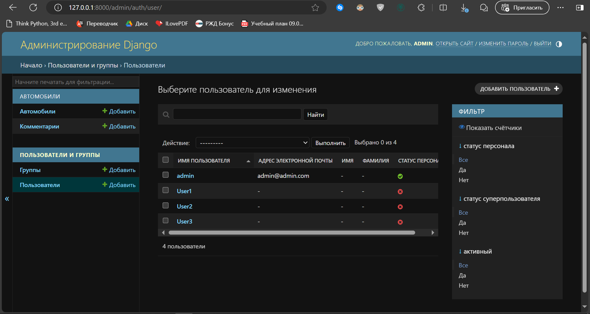
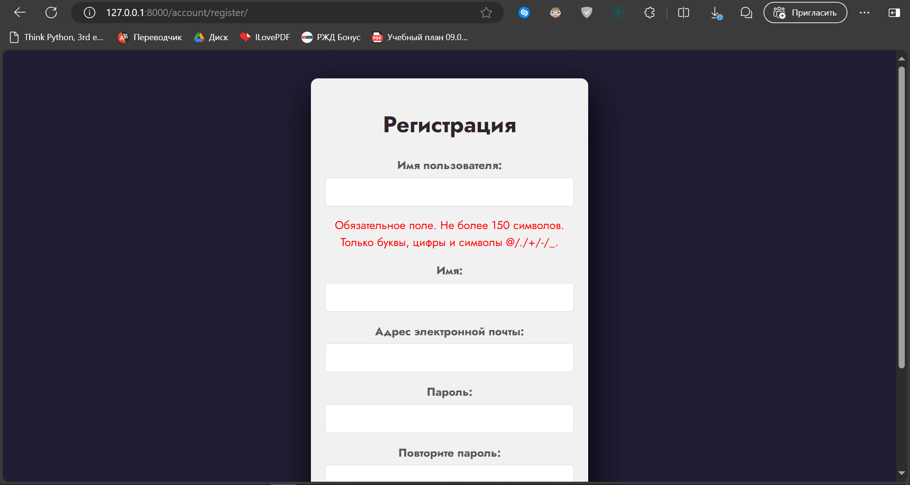
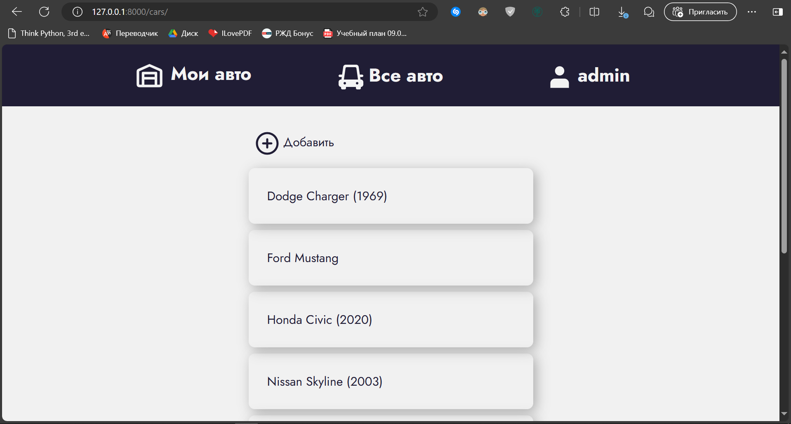
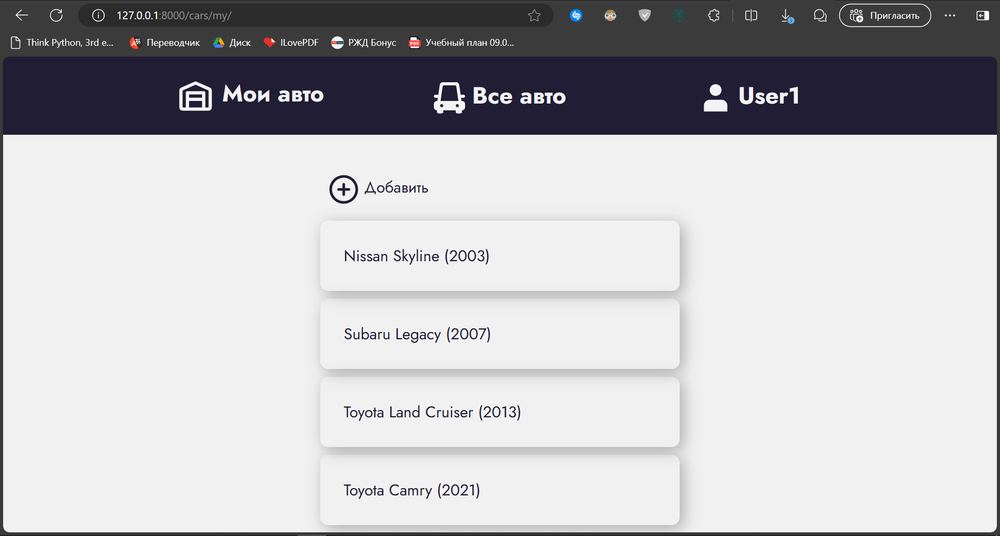
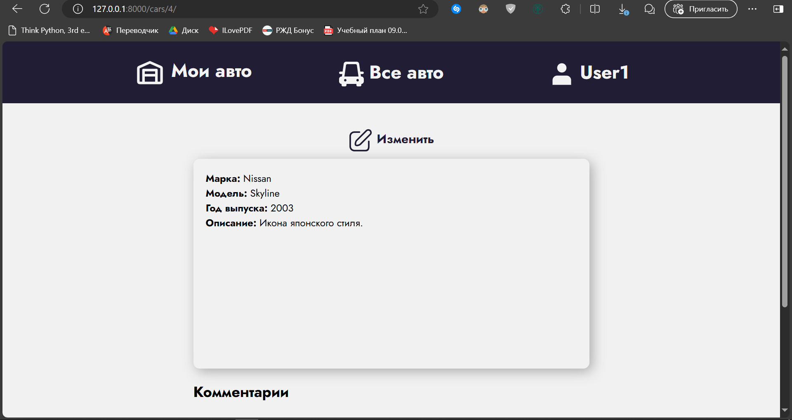
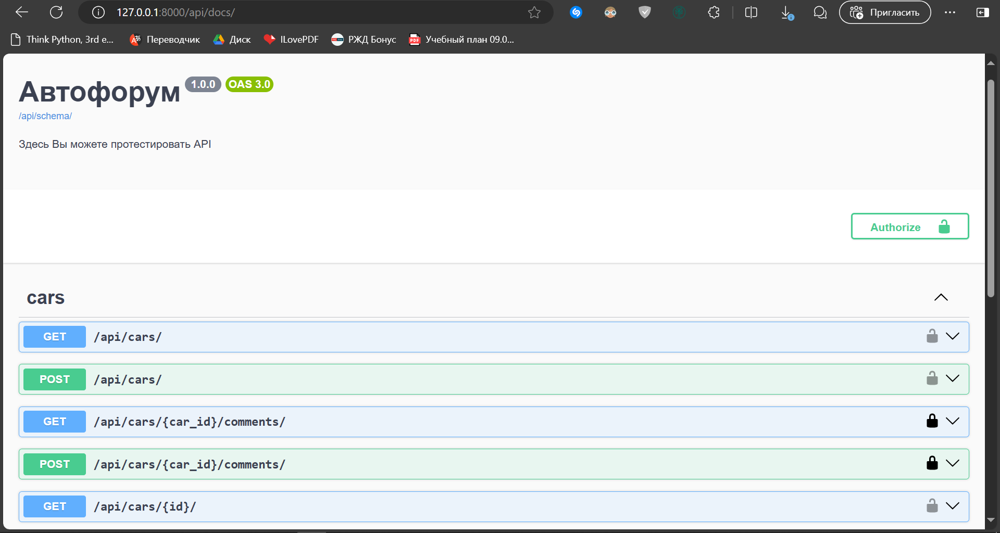
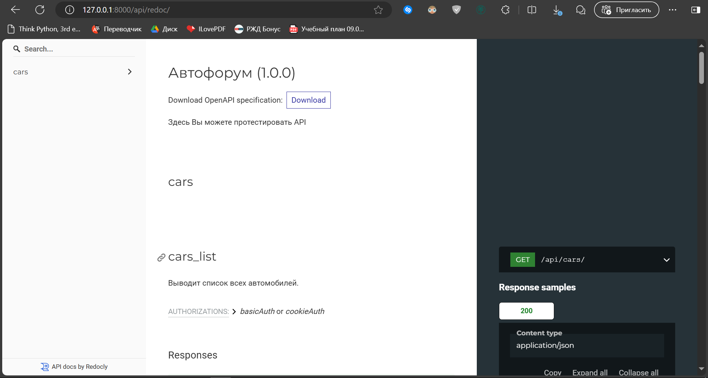

# Тестовое задание IT-Solutions

Веб-приложение для управления информацией об автомобилях с использованием API


## Запуск проекта:

1) Клонируйте репозиторий с проектом

```bash
git clone https://github.com/Egore000/Test-task.git 
cd Test-task/
```

2) Запустите `docker-compose`

```bash
docker compose up
```

3) Примените миграции

```bash
docker compose run django python manage.py migrate
```

4) Создайте суперпользователя
   
```bash
docker compose run django python manage.py createsuperuser
```

## Использование приложения

* Регистрация пользователя:
  1) С помощью админ-панели: http://127.0.0.1:8000/admin/
   
    
   
  2) Через форму создания пользователя: http://127.0.0.1:8000/account/register/
   
   
  
* Список всех авто: http://127.0.0.1:8000/cars/

    

* Список автомобилей пользователя: http://127.0.0.1:8000/cars/my/

    

* Информация о конкретном автомобиле: http://127.0.0.1:8000/cars/{car_id}/

    

## API

Документация к API в формате Swagger и Redoc доступна по адресам:

Swagger: http://127.0.0.1:8000/api/docs/



Redoc: http://127.0.0.1:8000/api/redoc/



